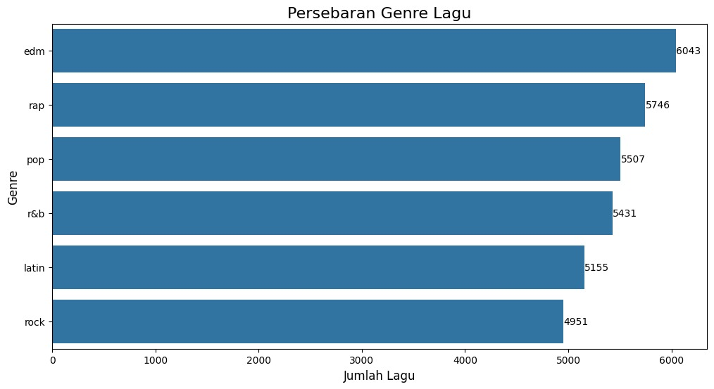
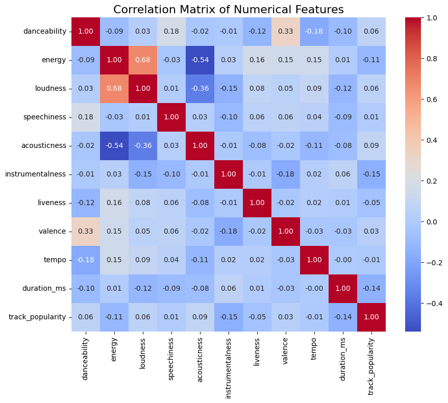

# ProyekAkhirAnalisisBigData
**Proyek Akhir Analisis Big Data** adalah luaran mata kuliah yang diampu oleh **Bapak Yuda Munarko, S.Kom., M.Sc.** Proyek ini bertujuan menganalisis data Spotify untuk memahami pola genre musik melalui klasifikasi, visualisasi, dan eksplorasi data. Luaran ini bermanfaat untuk penyedia konten, konsumen, dan pengembang fitur berbasis data.

# Song Popularity Prediction on Spotify Through Classification Models 🎧

## Tim Kami
1. **Marsela Margareta** - NIM: 202110370311247 (Kelas: Analisis Big Data A)  
2. **Uswatun Chasanah** - NIM: 202110370311274 (Kelas: Analisis Big Data A)  
3. **Akhtar Azizi Farid** - NIM: 202110370311281 (Kelas: Analisis Big Data C)  

---

## Pendahuluan
### Pernyataan Masalah
Popularitas sebuah lagu sering kali menjadi tolok ukur kesuksesan dalam industri musik. Bagi artis, produser, dan label rekaman, memahami faktor yang menentukan popularitas lagu sangatlah penting untuk menciptakan karya yang tidak hanya relevan secara artistik tetapi juga menarik bagi audiens. Dengan meningkatnya platform streaming musik seperti Spotify, data terkait performa lagu kini dapat diakses dengan lebih mudah. Penelitian untuk memprediksi popularitas lagu dapat membantu industri musik membuat keputusan yang lebih strategis dan meningkatkan peluang sukses lagu baru. Selain itu, hasil analisis ini memungkinkan penyusunan strategi promosi yang lebih efektif, misalnya, menentukan waktu rilis yang tepat atau segmen pendengar yang potensial. Untuk platform streaming musik, analisis ini membantu dalam menyusun playlist yang lebih personal dan relevan, meningkatkan engagement pengguna. Topik ini menarik karena menggabungkan dunia musik dengan teknologi data science untuk memberikan wawasan yang berharga.

Analisis ini penting untuk memahami preferensi pendengar musik, yang berguna bagi pengembang konten, penyusun playlist, maupun konsumen umum.

### Rencana Penyelesaian Masalah
1. **Dataset**: Data diperoleh dari [link ini](https://www.dropbox.com/sh/qj0ueimxot3ltbf/AACzMOHv7sZCJsj3ErjtOG7ya?dl=1). Dataset ini mencakup berbagai informasi tentang lagu, seperti genre, durasi, energy, dan atribut lain yang relevan.
2. **Metodologi**: Kami akan membersihkan data, mengeksplorasi metrik penting, dan menggunakan teknik seperti visualisasi data dan klasifikasi untuk memahami pola dalam genre musik.
3. **Teknik Analisis**: Menggunakan eksplorasi data deskriptif, klasifikasi dengan KNNClassifier, SVMClassifier dan XGBOOST, serta visualisasi mendalam menggunakan Matplotlib dan Seaborn.

### Manfaat Analisis
Hasil analisis ini akan membantu:
- Konsumen dalam menemukan genre yang sesuai dengan preferensi mereka.
- Spotify untuk mengembangkan fitur-fitur yang lebih relevan berdasarkan data analitik.
- Penyedia konten untuk menyusun strategi distribusi musik.

---

## Memuat Package yang Diperlukan
- pandas
- numpy
- matplotlib.pyplot
- seaborn
- scikit-learn
- xgboost

atau bisa dilihat pada file requirements.txt

# Menonaktifkan pesan peringatan
``` python
import warnings
warnings.filterwarnings("ignore")
```
---

## Data Preparation
### Sumber Data
- Dataset tersedia dalam [tautan berikut ini](https://raw.githubusercontent.com/rfordatascience/tidytuesday/main/data/2020/2020-01-21/spotify_songs.csv)
- Dataset diperoleh dari download secara langsung dengan menggunakan [link berikut ini](https://www.dropbox.com/sh/qj0ueimxot3ltbf/AACzMOHv7sZCJsj3ErjtOG7ya?dl=1).

### Deskripsi Dataset
Dataset **Spotify Songs** diambil pada tanggal 21 Januari 2020 melalui paket R bernama **spotifyr**, yang dirancang oleh Charlie Thompson, Josiah Parry, Donal Phipps, dan Tom Wolff untuk mempermudah pengambilan data pribadi atau metadata umum dari API Spotify. Tujuan awal dari dataset ini adalah menyediakan metadata lagu yang memungkinkan pengguna untuk menganalisis berbagai fitur audio seperti danceability, energy, tempo, dan lainnya. Dataset ini dirancang untuk mendukung eksplorasi berbasis data terkait karakteristik musik, analisis genre, dan tren musik populer, serta memfasilitasi eksperimen dalam machine learning, seperti klasifikasi lagu berdasarkan genre atau clustering berdasarkan fitur audio. Dataset ini berisi sekitar 5000 lagu dari 6 kategori utama, yaitu EDM, Latin, Pop, R&B, Rap, dan Rock.  

Dataset ini memiliki **23 variabel**, antara lain:  
1. **track_id** (ID unik untuk setiap lagu),  
2. **track_name** (nama lagu),  
3. **track_artist** (nama artis),  
4. **track_popularity** (popularitas lagu, skala 0–100),  
5. **track_album_id** (ID unik album),  
6. **track_album_name** (nama album),  
7. **track_album_release_date** (tanggal rilis album),  
8. **playlist_name** (nama playlist),  
9. **playlist_id** (ID unik playlist),  
10. **playlist_genre** (genre playlist),  
11. **playlist_subgenre** (subgenre playlist),  
12. **danceability** (kelayakan untuk menari, 0.0–1.0),  
13. **energy** (intensitas dan aktivitas, 0.0–1.0),  
14. **key** (nada dasar lagu, 0–11),  
15. **loudness** (kekerasan suara dalam desibel),  
16. **mode** (modus lagu, 0 untuk minor dan 1 untuk mayor),  
17. **speechiness** (proporsi elemen ucapan, 0.0–1.0),  
18. **acousticness** (keakustikan lagu, 0.0–1.0),  
19. **instrumentalness** (tingkat instrumental, 0.0–1.0),  
20. **liveness** (kemungkinan direkam live, 0.0–1.0),  
21. **valence** (tingkat positif atau kebahagiaan, 0.0–1.0),  
22. **tempo** (kecepatan dalam BPM), dan  
23. **duration_ms** (durasi lagu dalam milidetik).  

Kekhasan data sumber mencakup bagaimana nilai yang hilang dicatat dan dikelola. Dalam dataset ini, nilai yang hilang dicatat menggunakan **NA** (Not Available), yang merupakan standar dalam lingkungan R untuk menunjukkan data yang tidak tersedia atau hilang. Nilai hilang dapat terjadi pada variabel tertentu karena keterbatasan metadata yang disediakan oleh API Spotify, misalnya jika sebuah lagu atau album tidak memiliki informasi seperti genre, subgenre, atau nilai akustik. Penyebab lainnya bisa mencakup masalah teknis dalam pengambilan data melalui API, seperti batasan akses atau kesalahan permintaan.  

Untuk menangani nilai hilang, pengguna dapat menerapkan beberapa metode imputasi seperti:  
1. **Menggunakan rata-rata atau median** untuk variabel numerik seperti `danceability`, `energy`, atau `tempo`.  
2. **Menggunakan mode** untuk variabel kategori seperti `playlist_genre` atau `playlist_subgenre`.  
3. **KNN imputasi** untuk memperkirakan nilai hilang berdasarkan kemiripan dengan data lain.  
4. **Model prediktif**, di mana variabel dengan nilai hilang diprediksi menggunakan model berdasarkan variabel lain.  
5. **Menghapus baris atau kolom** yang mengandung nilai hilang jika jumlahnya relatif kecil.  

Pengguna disarankan untuk menangani nilai yang hilang ini sesuai kebutuhan analisis atau model yang digunakan. Dataset ini sebelumnya digunakan oleh Kaylin Pavlik dalam blognya untuk mengeksplorasi dan mengklasifikasi lagu berdasarkan fitur audio. Dokumentasi lebih lengkap dapat ditemukan di [ReadMe Spotify Songs (TidyTuesday)](https://github.com/rfordatascience/tidytuesday/blob/master/data/2020/2020-01-21/readme.md).


### Langkah Pembersihan Data
1. **Mengimpor Data**:
   Dataset diimpor menggunakan Pandas.
2. **Penanganan Missing Values**:
   Missing values diisi menggunakan strategi mean/mode dengan `SimpleImputer`.
3. **Normalisasi Data**:
   Data numerik dinormalisasi menggunakan `MinMaxScaler`.
4. **Menghapus Kolom Yang Tidak di Gunakan**:
   Data atau kolom yang tidak relevan dan tidak memiliki keterkaitan terhadap proses analisis di drop atau dihapus kolom tersebut guna mempermudah dalam melakukan proses analisis selanjutnya dan menghasilkan data yang bersih, kolom `track_id`, `track_album_id`, dan `playlist_id` dihapus karena kolom-kolom tersebut tidak terdapat nilai yang spesifik sehingga tidak dapat atau tidak ada kelayakan untuk melakukan analisis dimana kolom tersebut berisikan angka dan huruf bercampuran.

### Dataset Setelah Dibersihkan
Setelah pembersihan, data final mencakup 21 kolom utama yang siap untuk dianalisis lebih lanjut. Berikut adalah cuplikan data:
|index|track\_name|track\_artist|track\_popularity|track\_album\_name|track\_album\_release\_date|playlist\_name|playlist\_genre|playlist\_subgenre|danceability|energy|key|loudness|mode|speechiness|acousticness|instrumentalness|liveness|valence|tempo|duration\_ms|
|---|---|---|---|---|---|---|---|---|---|---|---|---|---|---|---|---|---|---|---|---|
|0|i dont care with justin bieber  loud luxury remix|ed sheeran|66\.0|i dont care with justin bieber loud luxury remix|2019-06-14|pop remix|pop|dance pop|0\.748|0\.916|6\.0|-2\.634|1\.0|0\.0583|0\.102|0\.0|0\.0653|0\.518|122\.036|194754\.0|
|1|memories  dillon francis remix|maroon 5|67\.0|memories dillon francis remix|2019-12-13|pop remix|pop|dance pop|0\.726|0\.815|11\.0|-4\.969|1\.0|0\.0373|0\.0724|0\.00421|0\.357|0\.693|99\.972|162600\.0|
|2|all the time  don diablo remix|zara larsson|70\.0|all the time don diablo remix|2019-07-05|pop remix|pop|dance pop|0\.675|0\.931|1\.0|-3\.432|0\.0|0\.0742|0\.0794|2\.33e-05|0\.11|0\.613|124\.008|176616\.0|
|3|call you mine  keanu silva remix|the chainsmokers|60\.0|call you mine  the remixes|2019-07-19|pop remix|pop|dance pop|0\.718|0\.93|7\.0|-3\.778|1\.0|0\.102|0\.0287|9\.43e-06|0\.204|0\.277|121\.956|169093\.0|
|4|someone you loved  future humans remix|lewis capaldi|69\.0|someone you loved future humans remix|2019-03-05|pop remix|pop|dance pop|0\.65|0\.833|1\.0|-4\.672|1\.0|0\.0359|0\.0803|0\.0|0\.0833|0\.725|123\.976|189052\.0|

---

## Eksplorasi dan Analisis Data
### Pendekatan Analisis
1. **Deskripsi Data**:
   - Membuat distribusi genre musik menggunakan bar chart.
   - Menampilkan korelasi antara energy dan danceability.   
2. **Klasifikasi**:
   - Mengelompokkan popularitas lagu ke dalam tiga kategori berdasarkan skor pada kolom `track_popularity`: **High** (skor > 80) untuk lagu sangat populer dengan daya tarik tinggi, **Medium** (skor 50–80) untuk lagu dengan popularitas sedang dan audiens cukup luas, serta **Low** (skor < 50) untuk lagu yang kurang populer atau diminati segmen terbatas.
3. **Pembuatan Variabel Baru**:
   - Menambahkan variabel baru seperti "popularitas relatif" berdasarkan metrik tertentu.
   - Menambahkan fitur baru yaitu `danceability_to_energy_ratio` dibuat untuk menganalisis keseimbangan atau rasio antara danceability (kemampuan lagu untuk mengundang tarian) dan energy (intensitas lagu).

### Hasil Temuan 
1. **Visualisasi Distribusi Genre**:
   

2. **Rata-Rata Popularitas Berdasarkan Genre Lagu**

   

   - Pop memiliki rata-rata popularitas tertinggi dibandingkan genre lainnya, menunjukkan bahwa genre ini cenderung lebih disukai dan memiliki daya tarik universal bagi          audiens.
   - Latin menempati posisi kedua, mencerminkan pertumbuhan signifikan dari genre ini di industri musik global, dengan artis-artis yang sering mencapai kesuksesan                internasional.
   - Rap, Rock, dan R&B memiliki rata-rata popularitas yang hampir setara, mengindikasikan bahwa genre-genre ini memiliki basis audiens yang kuat tetapi tidak seuniversal          pop.
   - EDM memiliki rata-rata popularitas terendah di antara genre yang ditampilkan, yang mungkin menunjukkan bahwa genre ini lebih segmented atau memiliki daya tarik yang         lebih niche.


4. **Korelasi Antar Kolom Numerik**:
   

   Berdasarkan matriks di atas dapat disimpulkan :
   
   a. **Danceability dan Valence**: Korelasi positif moderat sebesar 0.33, menunjukkan bahwa lagu yang lebih "danceable" cenderung memiliki suasana lebih ceria atau positif.
   
   b. **Energy dan Loudness**: Korelasi tinggi sebesar 0.68, menunjukkan bahwa lagu dengan energi tinggi biasanya memiliki tingkat kekerasan suara (loudness) yang lebih besar.
   
   c. **Acousticness dan Energy**: Korelasi negatif signifikan sebesar -0.54, menunjukkan bahwa lagu dengan sifat akustik yang tinggi cenderung memiliki energi lebih rendah.
   
   d. **Track Popularity**: Tidak memiliki korelasi yang sangat kuat dengan fitur lainnya, yang menunjukkan bahwa popularitas lagu mungkin dipengaruhi oleh kombinasi banyak           faktor atau variabel eksternal (misalnya, promosi atau preferensi audiens).
---

## Metode & Hasil Penelitian

A. **K-Nearest Neighbors (KNN)**

Algoritma ini menghitung jarak antara lagu tersebut dengan lagu-lagu lain dalam dataset latih, kemudian memilih K tetangga terdekat. Berikut hasil klasifikasi menggunakan KNN : 


Berdasarkan confusion matrik di atas, dapat disimpulkan sebagai berikut : 

- Model memiliki performa terbaik pada kelas Low (2441 prediksi benar) dibandingkan kelas High (179 prediksi benar) dan       Medium (1217 prediksi benar).
- Kesalahan terbesar terjadi pada kelas Medium yang sering diprediksi sebagai Low (1313 sampel). Hal ini mungkin              menunjukkan adanya overlap dalam fitur antara kelas Medium dan Low.
- Kelas High memiliki jumlah prediksi benar yang lebih sedikit dibanding kelas lain, kemungkinan karena ukuran data kelas     High lebih kecil atau karena model sulit memisahkan fitur kelas High dari kelas lainnya.

B. **Support Vector Machine (SVM)**
SVM mencari hyperplane (garis pemisah) yang membedakan kategori-kategori tersebut dengan memaksimalkan margin antara data dari setiap kategori. Jika data tidak dapat dipisahkan secara linear, SVM menggunakan kernel untuk memetakan data ke dimensi yang lebih tinggi agar pemisahan antar kelas dapat dilakukan.


- Model cenderung memiliki performa yang cukup baik pada kelas Medium (1846 benar), tetapi mengalami kesalahan yang           signifikan dalam mengklasifikasikan data ke kelas Low (banyak data dari kelas lain masuk ke Low).
- Kesalahan terbesar terjadi saat mengklasifikasikan kelas Low dan Medium, dengan banyaknya data yang salah diprediksi di     antara kedua kelas tersebut.
- Kelas High memiliki jumlah kesalahan prediksi yang relatif lebih kecil dibandingkan kelas lain.


C. **Extreme Gradient Boosting (XGBoost)**

Dalam konteks prediksi popularitas lagu, XGBoost digunakan untuk memprediksi kategori popularitas lagu ("High", "Medium", atau "Low") dengan membangun model yang menggabungkan beberapa pohon keputusan secara berurutan, di mana setiap pohon keputusan baru berfokus pada kesalahan yang dibuat oleh pohon sebelumnya. 


- Kinerja model pada kelas Medium sangat baik, dengan 2880 data diklasifikasikan benar, menunjukkan bahwa model dapat         mengenali kelas Medium dengan akurasi tinggi.
- Kelas Low menunjukkan banyak kesalahan klasifikasi ke kelas Medium (1359 data), sehingga perlu ditingkatkan akurasi untuk   membedakan antara Medium dan Low.
- Kelas High memiliki jumlah data yang cukup kecil, tetapi masih terdapat beberapa kesalahan klasifikasi ke Medium (30) dan   Low (49).
  
Sebagian besar kesalahan terjadi antara kelas Medium dan Low, yang mungkin menunjukkan kesamaan fitur yang menyebabkan kebingungan pada model.

## Rangkuman 🗒️✏️
### Pernyataan Masalah Yang Dibahas
Kelompok kami mengangkat permasalahan terkait popularitas lagu berdasarkan skor popularitas yang terdapat dalam dataset Spotify Songs. Skor popularitas ini mencerminkan seberapa besar daya tarik atau perhatian yang diterima sebuah lagu di platform Spotify. Untuk analisis ini, kami membagi lagu-lagu dalam dataset ke dalam tiga kategori berdasarkan kriteria berikut:  

1. *High Popularity*: Lagu dengan skor popularitas di atas 80 dianggap sangat populer. Lagu-lagu ini biasanya memiliki daya tarik yang tinggi di kalangan audiens, sering menjadi hits besar, dan mendominasi playlist populer.  
2. *Medium Popularity*: Lagu dengan skor popularitas antara 50 hingga 80 dianggap memiliki popularitas sedang. Lagu-lagu dalam kategori ini memiliki audiens yang cukup luas tetapi belum mencapai puncak popularitas.  
3. *Low Popularity*: Lagu dengan skor di bawah 50 dianggap memiliki popularitas rendah. Lagu-lagu ini cenderung kurang menarik perhatian atau hanya diminati oleh segmen audiens tertentu.  

Tujuan utama dari pengelompokkan ini adalah untuk memahami faktor-faktor yang memengaruhi skor popularitas sebuah lagu. Dengan menganalisis fitur audio yang relevan seperti danceability, energy, tempo, loudness, dan lainnya, kami berharap dapat menemukan pola atau karakteristik unik yang menentukan tingkat popularitas sebuah lagu.

### Data yang Digunakan dan Metodologi
Penelitian ini menggunakan dataset Spotify Songs, yang berisi informasi lengkap mengenai lagu-lagu yang ada di platform Spotify. Dataset ini mencakup berbagai atribut, seperti nama lagu, nama artis, nama album, serta skor popularitas yang mencerminkan seberapa populer suatu lagu di kalangan pengguna Spotify. Selain itu, dataset ini juga mencakup fitur audio seperti tingkat danceability, energy, tempo, loudness, dan lainnya, yang menggambarkan karakteristik musik dari setiap lagu. Berdasarkan skor popularitas tersebut, lagu-lagu dalam dataset dibagi menjadi tiga kategori: High Popularity, Medium Popularity, dan Low Popularity, yang masing-masing mewakili tingkat popularitas yang berbeda. Untuk menganalisis faktor-faktor yang memengaruhi popularitas lagu, penelitian ini menerapkan tiga algoritma klasifikasi yang umum digunakan, yaitu K-Nearest Neighbors (KNN), Support Vector Machine (SVM), dan XGBoost. Ketiga algoritma ini dipilih karena kemampuan mereka dalam menangani data yang kompleks dan dapat memberikan wawasan yang lebih mendalam mengenai pola-pola yang ada dalam fitur audio lagu. Dalam penelitian ini, kami akan membandingkan kinerja dari masing-masing algoritma untuk menentukan mana yang paling efektif dalam mengklasifikasikan lagu berdasarkan tingkat popularitasnya, dengan harapan dapat mengidentifikasi faktor-faktor audio yang berperan besar dalam menarik perhatian pendengar di Spotify.

### Temuan Menarik
- Genre "Pop" mendominasi daftar lagu, diikuti oleh "Rock".
- Lagu dengan energy tinggi lebih cenderung memiliki danceability tinggi.

### Implikasi Analisis
- Konsumen dapat menggunakan wawasan ini untuk menemukan musik yang sesuai dengan preferensi mereka.
- Spotify dapat memanfaatkan pola ini untuk meningkatkan rekomendasi.

### Keterbatasan
- Analisis ini terbatas pada atribut yang ada dalam dataset.
- Penelitian lebih lanjut dapat mencakup data tambahan seperti lirik lagu atau sentimen pendengar.

---

**Catatan:**
Kode lengkap dapat dijalankan tanpa error dan telah diuji dengan dataset terkait. README ini memberikan pengantar untuk memahami dan mereplikasi analisis kami.

